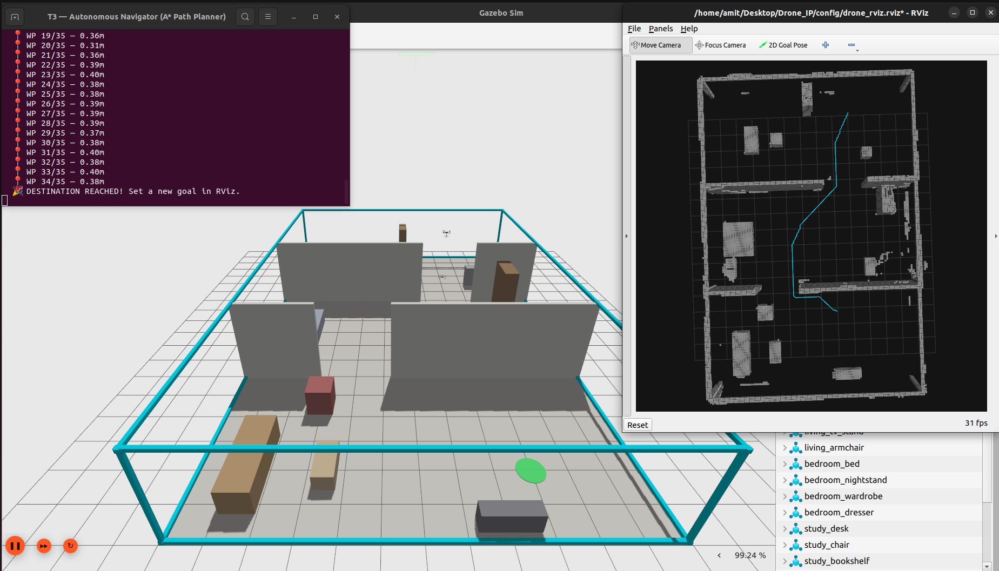
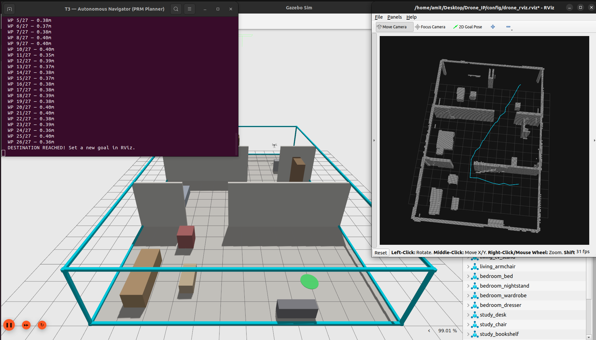
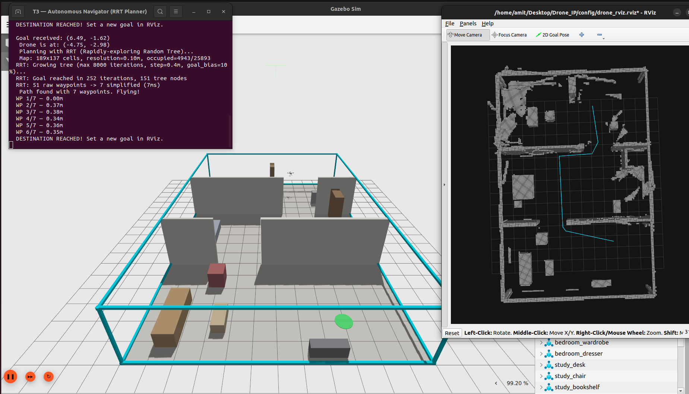
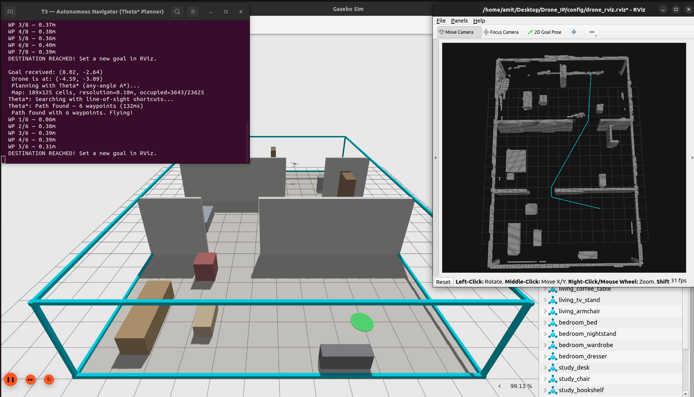

# 🚁 Autonomous Indoor Drone Navigation

> **Sensor-based 3D mapping and multi-algorithm path planning for GPS-denied indoor flight using ROS 2, PX4, and Gazebo.**

A fully autonomous drone simulation pipeline where a quadcopter **explores** an unknown indoor environment using its depth camera, **builds a persistent 3D map** with OctoMap, and **navigates** collision-free paths using **6 different path planning algorithms** (A\*, Dijkstra, Bellman Ford, PRM, RRT, Theta\*) — all without GPS or prior knowledge of the room layout. Includes a **visual benchmark mode** that runs all algorithms simultaneously, **real-time obstacle avoidance**, and **automated performance comparison**.


---

## 📋 Project Evolution

This project grew through progressive problem-solving — each milestone was driven by a real limitation discovered in the previous phase.

| Phase | Milestone | What We Learned |
|:---:|:---|:---|
| 1 | Environment Setup | Ubuntu 22.04, ROS 2 Humble, PX4 SITL, Gazebo Garden — foundation ready |
| 2 | Indoor World Design | Custom SDF environments with realistic obstacles |
| 3 | Blind Waypoint Navigation | **❌ Crashed into walls** → proved sensors are essential |
| 4 | Keyboard Teleoperation | Manual WASD control → proved the PX4 control pipeline works |
| 5 | Depth Camera Integration | `x500_depth` with OakD-Lite (640×480 @ 30fps) — gave the drone "eyes" |
| 6 | Point Cloud Filtering | Voxel Grid + SOR (307K → ~170 pts/frame) — cleaned noisy data |
| 7 | OctoMap 3D Mapping | Persistent voxel map from depth camera — the drone now "remembers" |
| 8 | A\* Path Planning | First successful autonomous navigation — but paths were stair-cased |
| 9 | Multi-Room House | 3 rooms with staggered doorways — tested real indoor complexity |
| 10 | 4 More Algorithms | PRM, RRT, Theta\*, Dijkstra, Bellman Ford — for comparison |
| 11 | Visual Benchmark | Run all 6 at once, 6 colored paths in RViz — immediate comparison |
| 12 | Drone Stability | Velocity clamping + yaw smoothing — smoother, safer flight |
| 13 | Obstacle Avoidance | Real-time path monitoring + dynamic replanning — safety net |

---

## 🏗️ System Architecture

```
┌───────────────────────────────────────────────────────────────────────┐
│                        GAZEBO GARDEN v7.9.0                          │
│  ┌──────────────────┐  ┌────────────┐  ┌──────────────────────────┐  │
│  │ 3-Room House     │  │ x500_depth │  │ OakD-Lite Depth Camera   │  │
│  │ 18×12×3m         │  │ Drone      │  │ 640×480 @ 30fps          │  │
│  │ 12 furniture pcs │  │ Model      │  │ Range: 0.3–5.0m          │  │
│  └──────────────────┘  └────────────┘  └──────────────────────────┘  │
└──────────────────────────────┬────────────────────────────────────────┘
                               │ Gazebo Transport
                               ▼
                    ┌──────────────────────┐
                    │   ros_gz_bridge      │
                    │   (Topic Bridging)   │
                    └──────────┬───────────┘
                               │ ROS 2 Topics
              ┌────────────────┼──────────────────┐
              ▼                ▼                  ▼
   ┌──────────────┐  ┌────────────────┐  ┌──────────────────┐
   │ PX4 Autopilot│  │ Point Cloud    │  │ TF Broadcaster   │
   │ (SITL)       │  │ Filter Node    │  │                  │
   │              │  │ 307K→170 pts   │  │ map → base_link  │
   │ Odometry ────┼──┤                │  │    → camera      │
   └──────────────┘  └───────┬────────┘  └───────┬──────────┘
                             │                    │
                             ▼                    ▼
                    ┌──────────────────────────────────────┐
                    │          OctoMap Server               │
                    │   Persistent 3D Occupancy Map         │
                    │   Resolution: 10cm | Range: 5m        │
                    └─────────────┬────────────────────────┘
                                  │
                    ┌─────────────┼────────────────┐
                    ▼                              ▼
          ┌──────────────────┐          ┌──────────────────┐
          │    RViz2          │          │  Path Planner    │
          │  3D Visualization │          │  /projected_map  │
          │  (grey voxels)    │          │  6 algorithms    │
          └──────────────────┘          └──────────────────┘
```

---

## 🖥️ Tech Stack

| Component | Version | Purpose |
|:---|:---|:---|
| **Ubuntu** | 22.04 LTS (Jammy) | Operating System |
| **ROS 2** | Humble Hawksbill | Robotics middleware |
| **PX4 Autopilot** | v1.14 (SITL) | Flight controller firmware |
| **Gazebo** | Garden v7.9.0 | 3D physics simulator |
| **Micro-XRCE-DDS** | v2.4.x | PX4 ↔ ROS 2 bridge |
| **OctoMap** | v1.9.8 | 3D occupancy mapping |
| **PCL-ROS** | v2.4.5 | Point cloud processing |
| **Python** | 3.10 + NumPy | ROS 2 node scripting |
| **Path Planners** | A\*, Dijkstra, Bellman Ford, PRM, RRT, Theta\* | 6-algorithm comparison |

---

## 🏠 Simulation Environments

### Environment 1 — Single Room (10×8×3m)

The initial test environment: a single room with 3 color-coded obstacles. This is where the perception + mapping pipeline was first proven, and where A\* first successfully navigated around obstacles.

| Obstacle | Type | Position | Purpose |
|:---|:---|:---|:---|
| 🔴 Red Pillar | Box (0.5×0.5×2.5m) | (0, 1) | Blocks the direct path |
| 🟠 Orange Wall | Box (2.0×0.3×1.5m) | (-1.5, -1) | Blocks lower corridor |
| 🟡 Yellow Pillar | Box (0.6×0.6×2.5m) | (2, 0) | Forces weaving maneuver |


**Why we moved past this:** A single room didn't test doorway navigation or multi-room planning. We needed a more realistic environment.

---

### Environment 2 — 3-Room House (18×12×3m)

A realistic multi-room house that tests the drone's ability to **explore through doorways** and **plan cross-room paths**.

```
         18m
┌──────────┬──────────┬──────────┐
│          │          │          │
│  LIVING  │ BEDROOM  │  STUDY   │
│  ROOM    │          │  ROOM    │  12m
│          │  🚁 Spawn│          │
│ 🛋️ Sofa  │ 🛏️ Bed   │ 🖥️ Desk  │
│ ☕ Table │ 🗄️ Ward. │ 📚 Books │
│ 📺 TV    │ 🪞 Dress.│ 🗃️ Files │
│ 🪑 Chair │          │ 🪑 Chair │
│          │          │          │
│ 🟢Start  │          │ 🔵 Dest  │
└────┘  └──┴────┘  └──┴─────────┘
   Door 1      Door 2
   (Y=+2)      (Y=-2)
   2.5m wide   2.5m wide
```

**Key features:**
- **12 furniture obstacles** across 3 rooms (sofa, bed, desk, bookshelf, wardrobe, etc.)
- **Staggered doorways** — Door 1 at Y=+2, Door 2 at Y=-2, forcing zig-zag paths
- **13 scan waypoints** — drone systematically explores all rooms through both doorways


---

## 🧠 Autonomous Navigation — How It Works

The drone does **not** know the room layout in advance. It discovers obstacles using its depth camera and OctoMap, then plans collision-free paths on the **sensor-derived map**.

```
                    ┌──────────────────┐
                    │  1. TAKEOFF      │
                    │  Ascend to 1.8m  │
                    └───────┬──────────┘
                            ▼
                    ┌──────────────────┐
                    │  2. EXPLORE      │
                    │  Fly to 13 scan  │──── Depth camera feeds ────┐
                    │  positions,      │                            ▼
                    │  rotate 360° at  │                   ┌─────────────────┐
                    │  each            │                   │  OctoMap Server  │
                    └───────┬──────────┘                   │  Builds 3D map  │
                            ▼                              │  from sensor     │
                    ┌──────────────────┐                   │  data            │
                    │  3. READY        │                   └────────┬────────┘
                    │  Hovering, map   │                            │
                    │  built           │                            ▼
                    └───────┬──────────┘                   ┌─────────────────┐
                            │ User clicks                  │ /projected_map  │
                            │ 2D Goal Pose                 │ (OccupancyGrid) │
                            ▼                              └────────┬────────┘
                    ┌──────────────────┐                            │
                    │  4. NAVIGATE     │◄── Planner runs on ────────┘
                    │  Follow path     │    real sensor map
                    │  to destination  │
                    │                  │◄── Obstacle avoidance:
                    │  (with real-time │    monitors path every 2s,
                    │   replanning)    │    replans if blocked
                    └──────────────────┘
```

### Exploration Phase
After takeoff, the drone autonomously visits **13 scan positions** spread across all 3 rooms. At each position, it performs a full **360° rotation** so the depth camera captures obstacles from every angle. The route goes: **Bedroom → Living Room → back through Bedroom → Study Room**.

### Sensor-Derived Path Planning
When the user sets a target via RViz's `2D Goal Pose`, the selected path planning algorithm runs on OctoMap's `/projected_map` — the real 2D projection of sensor-discovered obstacles. Obstacles are inflated by **0.25m** for safety clearance.

### Flight Stability
All navigators use **velocity clamping** (max 1.5m target delta) and **yaw smoothing** (angular interpolation) to prevent overshooting and jerky turns during waypoint following.

### Real-Time Obstacle Avoidance
During navigation, the drone **checks the latest OctoMap every 2 seconds** for new obstacles on the upcoming path. If a waypoint is now blocked (e.g., an object was moved into the path), the drone **hovers in place** and **replans from its current position** to the same destination using the updated map.

### Coordinate Bridge
The planner outputs waypoints in Gazebo ENU coordinates. A relative-delta conversion translates these to PX4 NED setpoints, making the system independent of coordinate origin mismatches.

---

## 💡 Design Decisions

### Why OctoMap instead of RTAB-Map?

While **RTAB-Map** (Real-Time Appearance-Based Mapping) offers loop closure and dense RGB-D reconstruction, it requires heavy CPU/GPU resources — especially when running alongside Gazebo, PX4 SITL, and 8 concurrent processes on a laptop. OctoMap provides sufficient 3D mapping fidelity for obstacle avoidance without the overhead of a full visual SLAM pipeline.

### Why not Ultrasonic Sensors?

The drone's OakD-Lite depth camera captures **307,200 distance points per frame** (equivalent to 307K ultrasonic sensors). A single camera provides complete 3D scene geometry, whereas ultrasonic sensors give only a single distance value in a narrow 15° cone. The depth camera enables dense 3D reconstruction; ultrasonics can only do simple proximity alerts.

### Real-World Transferability

This system is designed for real-world deployment:
- The planner uses **only sensor data** — no hardcoded room geometry
- Replace Gazebo with a real depth camera + localization (Vicon, T265, or VIO), and the same code works
- The scan waypoints can be replaced with **frontier-based exploration** for truly unknown environments

---

## 👁️ Perception Pipeline

### Depth Camera → Filtered Point Cloud

The OakD-Lite depth camera captures **307,200 raw 3D points per frame** at 30fps. Two filters clean this data:

1. **Voxel Grid Downsampling** — Divides space into 8cm cubes, replacing all points per cube with one average. Reduces volume by ~99%.
2. **Statistical Outlier Removal** — Points unusually far from their neighbors are noise and get removed.

**Result:** 307,200 raw → ~170 clean points per frame.

### 3D Occupancy Mapping (OctoMap)

OctoMap builds a **persistent 3D memory** from the filtered point cloud:
- Space is divided into **10cm voxels**
- Each voxel: **Occupied** (obstacle), **Free** (safe), or **Unknown** (unseen)
- The map **never forgets** — turning away from an obstacle doesn't erase it

The TF Broadcaster provides the camera's position in the world (`map → base_link → camera_frame`) so OctoMap knows where each depth frame was captured.


---

## 📂 Project Files

| File | Description |
|:---|:---|
| `launch_sim.sh` | One-command launcher — opens 8 coordinated terminals |
| **planners/** | |
| `planners/navigator_astar.py` | **A\*** — Grid-based search with f=g+h heuristic |
| `planners/navigator_dijkstra.py` | **Dijkstra** — A\* without heuristic (uniform cost) |
| `planners/navigator_bellman_ford.py` | **Bellman Ford** — Edge relaxation (V-1 iterations) |
| `planners/navigator_prm.py` | **PRM** — Probabilistic Roadmap with Dijkstra search |
| `planners/navigator_rrt.py` | **RRT** — Rapidly-exploring Random Tree |
| `planners/navigator_theta_star.py` | **Theta\*** — Any-angle A\* with line-of-sight shortcuts |
| `planners/navigator_benchmark.py` | **Visual Benchmark** — Runs all 6, shows colored paths |
| **benchmark/** | |
| `benchmark/save_map.py` | Saves OctoMap to disk for offline benchmarking |
| `benchmark/planner_library.py` | All 6 algorithms as pure functions (no ROS deps) |
| `benchmark/run_benchmark.py` | Automated benchmark with metrics table + CSV export |
| **core/** | |
| `core/keyboard_control.py` | Manual WASD drone controller with real-time position display |
| `core/pointcloud_filter.py` | Voxel Grid + SOR filter node (307K → 170 points) |
| `core/tf_broadcaster.py` | Publishes drone position as TF transforms for OctoMap |
| `core/room_scanner.py` | Automated room scanning flight patterns |
| **worlds/** | |
| `worlds/house_3room.sdf` | **Active world** — 3-room house (18×12m) with furniture |
| `worlds/indoor_10x8x3.sdf` | Legacy world — single room (10×8m) with 3 obstacles |
| **config/** | |
| `config/drone_rviz.rviz` | RViz2 config — OctoMap (grey) + paths (colored) |
| `config/octomap_params.yaml` | OctoMap server configuration |

---

## 🚀 Installation & Setup

> **Full dependency details:** [`requirements.txt`](requirements.txt)

### Prerequisites

```bash
# 1. Ubuntu 22.04 LTS
# 2. ROS 2 Humble
sudo apt update && sudo apt install -y ros-humble-desktop
echo "source /opt/ros/humble/setup.bash" >> ~/.bashrc && source ~/.bashrc

# 3. ROS 2 Packages
sudo apt install -y \
  ros-humble-ros-gzgarden-bridge \
  ros-humble-octomap ros-humble-octomap-server \
  ros-humble-octomap-msgs ros-humble-octomap-ros \
  ros-humble-octomap-rviz-plugins ros-humble-pcl-ros

# 4. PX4 Autopilot (SITL)
git clone https://github.com/PX4/PX4-Autopilot.git --recursive -b v1.14.0
cd PX4-Autopilot && bash ./Tools/setup/ubuntu.sh
make px4_sitl gz_x500_depth

# 5. Micro-XRCE-DDS Agent
git clone https://github.com/eProsima/Micro-XRCE-DDS-Agent.git
cd Micro-XRCE-DDS-Agent && mkdir build && cd build
cmake .. && make && sudo make install && sudo ldconfig

# 6. px4_msgs Workspace
mkdir -p ~/px4_ros_ws/src && cd ~/px4_ros_ws/src
git clone https://github.com/PX4/px4_msgs.git -b release/1.14
cd ~/px4_ros_ws && source /opt/ros/humble/setup.bash && colcon build

# 7. This Repository
cd ~/Desktop
git clone https://github.com/ami4go/Indoor-Drone-Navigation.git Drone_IP
chmod +x ~/Desktop/Drone_IP/launch_sim.sh
```

### Launch

```bash
# Manual flight (keyboard control):
~/Desktop/Drone_IP/launch_sim.sh

# Autonomous mode (default A*):
~/Desktop/Drone_IP/launch_sim.sh --auto

# Choose a specific algorithm:
~/Desktop/Drone_IP/launch_sim.sh --auto --algo astar      # A*
~/Desktop/Drone_IP/launch_sim.sh --auto --algo dijkstra    # Dijkstra
~/Desktop/Drone_IP/launch_sim.sh --auto --algo bellman     # Bellman Ford
~/Desktop/Drone_IP/launch_sim.sh --auto --algo prm         # Probabilistic Roadmap
~/Desktop/Drone_IP/launch_sim.sh --auto --algo rrt         # Rapidly-exploring Random Tree
~/Desktop/Drone_IP/launch_sim.sh --auto --algo theta       # Theta* (any-angle)
~/Desktop/Drone_IP/launch_sim.sh --auto --algo benchmark   # Visual Benchmark (all 6)
```

### What Opens (8 Terminals)

| Terminal | Process | Purpose |
|:---:|:---|:---|
| T1 | Micro-XRCE-DDS Agent | PX4 ↔ ROS 2 communication |
| T2 | PX4 + Gazebo | Flight controller + 3D simulation |
| T3 | Controller | Keyboard (manual) or Path Planner (auto) |
| T4 | GZ-ROS2 Bridge | Bridges depth camera + pose to ROS 2 |
| T5 | Point Cloud Filter | Cleans raw depth data in real-time |
| T6 | RViz2 | 3D visualization (grey OctoMap + colored paths) |
| T7 | TF Broadcaster | Drone-to-map coordinate transforms |
| T8 | OctoMap Server | Builds persistent 3D occupancy map |

### Keyboard Controls (Manual Mode)

| Key | Action |
|:---:|:---|
| `T` | Takeoff (arm + fly to 1.8m) |
| `L` | Land at current position |
| `W / S` | Forward / Backward |
| `A / D` | Left / Right |
| `R / F` | Altitude Up / Down |
| `Q` | Quit |

---

## 🖼️ Demo Gallery

### Full System View


### Individual Algorithm Paths

These screenshots show each algorithm's path on the same 3-room house, navigating from Bedroom to Study Room through the doorways.


---

## 📊 Path Planning Algorithm Comparison

All 6 algorithms run on the **same OctoMap-derived sensor map** of the 3-room house. The drone explores the environment identically; only the path planning strategy differs.

### Phase 1 Algorithms (Grid & Sampling Based)

#### A\* (Grid-Based Search)



- **Guarantees the shortest grid-optimal path** using f = g + h heuristic
- Paths follow the 8-connected grid (45° and 90° turns only)
- Fast and reliable — the baseline algorithm for all comparisons

#### PRM (Probabilistic Roadmap)



- **Scatters 600 random points** in free space, then connects neighbors with collision-free lines
- Produces **straight-line segments** between sample nodes (not grid-locked)
- Extra samples are seeded near doorways to handle narrow passage connectivity

#### RRT (Rapidly-exploring Random Tree)



- **Grows a tree from start** by randomly sampling and extending toward free space
- Fastest to find *a* path, but the result is **jagged with sharp turns**
- Path simplification removes redundant waypoints, but the drone may still clip corners

#### Theta\* (Any-Angle A\*)



- **Extension of A\*** that checks line-of-sight between grandparent and current node
- Produces the **smoothest, shortest paths** — true geometric shortest route at any angle
- Uses Bresenham's line algorithm to verify obstacle-free straight lines

### Phase 2 Algorithms (Added for Comparison)

#### Dijkstra (Uniform Cost Search)

- **A\* without the heuristic** — priority is `f = g` only (no estimated distance to goal)
- Explores uniformly in all directions like a spreading circle
- Produces the **exact same path as A\***, but explores ~2-3x more nodes because there's no guidance toward the goal
- Educational value: clearly demonstrates **why the heuristic matters**

#### Bellman Ford (Edge Relaxation)

- Iterates over **all edges V-1 times**, relaxing each one
- Designed for graphs with **negative edge weights** (our grid has only positive weights)
- On positive-weight grids, produces the **same path as Dijkstra but 30-50x slower**
- With bounded search region and early termination, still takes ~2500ms vs Dijkstra's ~80ms

### Visual Benchmark Mode

The benchmark mode (`--algo benchmark`) runs **all 6 algorithms simultaneously** when you click a goal, displaying all paths at once with different colors in RViz:

🔴 A\* — Red | 🟢 Dijkstra — Green | 🟡 Bellman Ford — Yellow | 🔵 PRM — Blue | 🟣 RRT — Magenta | ⚪ Theta\* — Cyan


The drone flies the **Theta\* path** (smoothest), while all 6 paths remain visible for visual comparison. The terminal prints a comparison table with planning time, path length, waypoint count, nodes explored, and smoothness angle.

---

## 📈 Algorithm Comparison Summary

| Property | A\* | Dijkstra | Bellman Ford | PRM | RRT | Theta\* |
|:---|:---:|:---:|:---:|:---:|:---:|:---:|
| **Optimal Path?** | ✅ Grid-optimal | ✅ Grid-optimal | ✅ Grid-optimal | ❌ Approximate | ❌ Non-optimal | ✅ True shortest |
| **Path Smoothness** | ⭐⭐ Staircase | ⭐⭐ Staircase | ⭐⭐ Staircase | ⭐⭐⭐ Straight segments | ⭐ Jagged | ⭐⭐⭐⭐ Smoothest |
| **Deterministic?** | ✅ Always same | ✅ Always same | ✅ Always same | ❌ Random each run | ❌ Random each run | ✅ Always same |
| **Narrow Passages** | ✅ Handles well | ✅ Handles well | ✅ Handles well | ⚠️ Needs seeding | ⚠️ Needs goal bias | ✅ Handles well |
| **Planning Speed** | ~60ms | ~100-190ms | ~2500ms | ~80-160ms | ~14ms (fastest) | ~400ms |
| **Nodes Explored** | ~8K | ~13K | ~335K edges | ~600 samples | ~200 tree nodes | ~7K |
| **Best For** | Reliable baseline | Understanding A\* | Negative-weight graphs | Large open spaces | Quick exploration | **Drone flight** |

---

## 🏆 Final Verdict: Best Algorithms for Indoor Drone Navigation

### 🥇 Theta\* — Best Overall for Indoor Drones

**Theta\* is the clear winner for indoor drone navigation.**

- Produces the **shortest true geometric path** (not locked to grid angles)
- Paths are **smooth with minimal turns** — ideal for a drone that needs gradual heading changes
- **Deterministic** — same input always gives the same output, critical for safety-critical applications
- Handles **narrow passages (doorways)** naturally without special seeding
- Moderate planning time (~400ms) is acceptable for non-real-time replanning

### 🥈 A\* — Best Reliable Fallback

**A\* is the safest, most predictable choice.**

- **Fast** (~60ms), **deterministic**, and **always finds the optimal grid path**
- Staircase paths are suboptimal for drones but work well with enough waypoint density
- Best choice when computation budget is tight or when simplicity matters
- The foundation that all other algorithms are compared against

### When to Use Each Algorithm

| Environment | Best Choice | Why |
|:---|:---|:---|
| **Indoor (small rooms, doorways)** | **Theta\*** | Smooth paths, handles narrow passages, optimal |
| **Indoor (quick replanning needed)** | **A\*** | Fast, deterministic, reliable fallback |
| **Large open spaces (outdoor/warehouse)** | **PRM** | Efficient for large free-space areas, multi-query |
| **Unknown/rapidly changing environment** | **RRT** | Fastest first-path discovery, good for exploration |
| **Academic comparison only** | **Dijkstra / Bellman Ford** | Same paths as A\* but slower — demonstrates algorithmic principles |

---

## 👤 Author

**Amit**

---

## 📄 License

This project is part of an academic Independent Project (IP) at IIIT Delhi.
