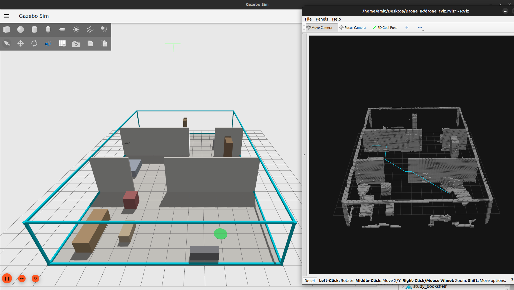
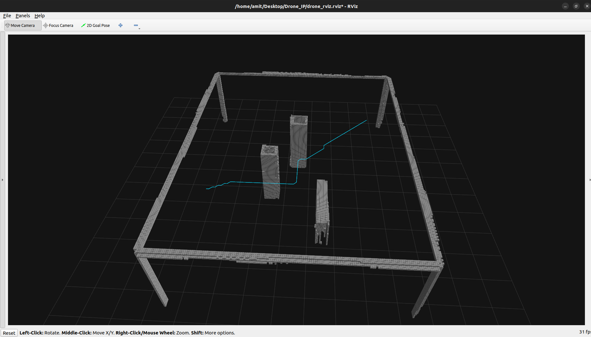
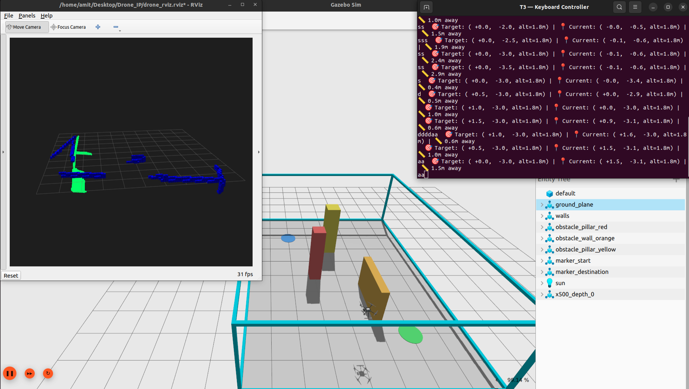

# 🚁 Autonomous Indoor Drone Navigation

> **Sensor-based 3D mapping and A\* path planning for GPS-denied indoor flight using ROS 2, PX4, and Gazebo.**

A fully autonomous drone simulation pipeline where a quadcopter **explores** an unknown indoor environment using its depth camera, **builds a persistent 3D map** with OctoMap, and **navigates** collision-free paths using A\* planning on real sensor data — all without GPS or prior knowledge of the room layout.



---

## 📋 Project Milestones

| Status | Milestone | Description |
|:---:|:---|:---|
| ✅ | Environment Setup | Ubuntu 22.04, ROS 2 Humble, PX4 SITL, Gazebo Garden |
| ✅ | Indoor World Design | Custom SDF environments with realistic obstacles |
| ✅ | Obstacle Navigation Proof | Blind waypoint nav crashes → proved sensors are needed |
| ✅ | Keyboard Teleoperation | Manual WASD control → proved PX4 control pipeline works |
| ✅ | Depth Camera Integration | `x500_depth` model with OakD-Lite stereo camera (640×480 @ 30fps) |
| ✅ | Gazebo-ROS 2 Bridge | Bridged depth image, point cloud, camera info, and clock topics |
| ✅ | Point Cloud Filtering | Voxel Grid + Statistical Outlier Removal (307K → ~170 pts/frame) |
| ✅ | OctoMap 3D Mapping | Persistent voxel occupancy grid from depth camera |
| ✅ | TF Broadcaster | Drone position as TF transforms for map alignment |
| ✅ | A* Path Planning | Sensor-derived obstacle-free route computation |
| ✅ | Autonomous Multi-Room Navigation | Drone explores 3-room house, plans paths through doorways |

---

## 🏗️ System Architecture

```
┌───────────────────────────────────────────────────────────────────────┐
│                        GAZEBO GARDEN v7.9.0                          │
│  ┌──────────────────┐  ┌────────────┐  ┌──────────────────────────┐  │
│  │ 3-Room House     │  │ x500_depth │  │ OakD-Lite Depth Camera   │  │
│  │ 18×12×3m         │  │ Drone      │  │ 640×480 @ 30fps          │  │
│  │ 12 furniture pcs │  │ Model      │  │ Range: 0.3–5.0m          │  │
│  └──────────────────┘  └────────────┘  └──────────────────────────┘  │
└──────────────────────────────┬────────────────────────────────────────┘
                               │ Gazebo Transport
                               ▼
                    ┌──────────────────────┐
                    │   ros_gz_bridge      │
                    │   (Topic Bridging)   │
                    └──────────┬───────────┘
                               │ ROS 2 Topics
              ┌────────────────┼──────────────────┐
              ▼                ▼                  ▼
   ┌──────────────┐  ┌────────────────┐  ┌──────────────────┐
   │ PX4 Autopilot│  │ Point Cloud    │  │ TF Broadcaster   │
   │ (SITL)       │  │ Filter Node    │  │                  │
   │              │  │ 307K→170 pts   │  │ map → base_link  │
   │ Odometry ────┼──┤                │  │    → camera      │
   └──────────────┘  └───────┬────────┘  └───────┬──────────┘
                             │                    │
                             ▼                    ▼
                    ┌──────────────────────────────────────┐
                    │          OctoMap Server               │
                    │   Persistent 3D Occupancy Map         │
                    │   Resolution: 10cm | Range: 5m        │
                    └─────────────┬────────────────────────┘
                                  │
                    ┌─────────────┼────────────────┐
                    ▼                              ▼
          ┌──────────────────┐          ┌──────────────────┐
          │    RViz2          │          │  A* Navigator    │
          │  3D Visualization │          │  /projected_map  │
          │  (grey voxels)    │          │  → path planning │
          └──────────────────┘          └──────────────────┘
```

---

## 🖥️ Tech Stack

| Component | Version | Purpose |
|:---|:---|:---|
| **Ubuntu** | 22.04 LTS (Jammy) | Operating System |
| **ROS 2** | Humble Hawksbill | Robotics middleware |
| **PX4 Autopilot** | v1.14 (SITL) | Flight controller firmware |
| **Gazebo** | Garden v7.9.0 | 3D physics simulator |
| **Micro-XRCE-DDS** | v2.4.x | PX4 ↔ ROS 2 bridge |
| **OctoMap** | v1.9.8 | 3D occupancy mapping |
| **PCL-ROS** | v2.4.5 | Point cloud processing |
| **Python** | 3.10 + NumPy | ROS 2 node scripting |
| **A\* Algorithm** | Custom | Sensor-based path planning |

---

## 🏠 Simulation Environments

This project includes two progressively complex environments:

### Environment 1 — Single Room (10×8×3m)

The initial test environment: a single room with 3 color-coded obstacles proving the perception + mapping pipeline.

| Obstacle | Type | Position | Purpose |
|:---|:---|:---|:---|
| 🔴 Red Pillar | Box (0.5×0.5×2.5m) | (0, 1) | Blocks the direct path |
| 🟠 Orange Wall | Box (2.0×0.3×1.5m) | (-1.5, -1) | Blocks lower corridor |
| 🟡 Yellow Pillar | Box (0.6×0.6×2.5m) | (2, 0) | Forces weaving maneuver |



---

### Environment 2 — 3-Room House (18×12×3m)

A realistic multi-room house that tests the drone's ability to **explore through doorways** and **plan cross-room paths**.

```
         18m
┌──────────┬──────────┬──────────┐
│          │          │          │
│  LIVING  │ BEDROOM  │  STUDY   │
│  ROOM    │          │  ROOM    │  12m
│          │  🚁 Spawn│          │
│ 🛋️ Sofa  │ 🛏️ Bed   │ 🖥️ Desk  │
│ ☕ Table │ 🗄️ Ward. │ 📚 Books │
│ 📺 TV    │ 🪞 Dress.│ 🗃️ Files │
│ 🪑 Chair │          │ 🪑 Chair │
│          │          │          │
│ 🟢Start  │          │ 🔵 Dest  │
└────┘  └──┴────┘  └──┴─────────┘
   Door 1      Door 2
   (Y=+2)      (Y=-2)
   2.5m wide   2.5m wide
```

**Key features:**
- **12 furniture obstacles** across 3 rooms (sofa, bed, desk, bookshelf, wardrobe, etc.)
- **Staggered doorways** — Door 1 at Y=+2, Door 2 at Y=-2, forcing zig-zag paths
- **13 scan waypoints** — drone systematically explores all rooms through both doorways
- **Cross-room A\* planning** — paths route through doorways automatically

| Room | Furniture |
|:---|:---|
| 🏠 Living Room | Sofa (brown), Coffee Table (wood), TV Stand (grey), Armchair (maroon) |
| 🛏️ Bedroom | Bed (blue-grey), Nightstand (wood), Wardrobe (dark brown), Dresser (light brown) |
| 📚 Study Room | Desk (wood), Office Chair (black), Bookshelf (dark wood), Filing Cabinet (grey) |


---

## 🧠 Autonomous Navigation — How It Works

The drone does **not** know the room layout in advance. It discovers obstacles using its depth camera and OctoMap, then plans collision-free paths on the **sensor-derived map**.

```
                    ┌──────────────────┐
                    │  1. TAKEOFF      │
                    │  Ascend to 1.8m  │
                    └───────┬──────────┘
                            ▼
                    ┌──────────────────┐
                    │  2. EXPLORE      │
                    │  Fly to 13 scan  │──── Depth camera feeds ────┐
                    │  positions,      │                            ▼
                    │  rotate 360° at  │                   ┌─────────────────┐
                    │  each            │                   │  OctoMap Server  │
                    └───────┬──────────┘                   │  Builds 3D map  │
                            ▼                              │  from sensor     │
                    ┌──────────────────┐                   │  data            │
                    │  3. READY        │                   └────────┬────────┘
                    │  Hovering, map   │                            │
                    │  built           │                            ▼
                    └───────┬──────────┘                   ┌─────────────────┐
                            │ User clicks                  │ /projected_map  │
                            │ 2D Goal Pose                 │ (OccupancyGrid) │
                            ▼                              └────────┬────────┘
                    ┌──────────────────┐                            │
                    │  4. NAVIGATE     │◄── A* plans on ────────────┘
                    │  Follow A* path  │    real sensor map
                    │  to destination  │
                    └──────────────────┘
```

### Exploration Phase
After takeoff, the drone autonomously visits **13 scan positions** spread across all 3 rooms. At each position, it performs a full **360° rotation** so the depth camera captures obstacles from every angle. The route goes: **Bedroom → Living Room → back through Bedroom → Study Room**.

### Sensor-Derived A\* Planning
When the user sets a target via RViz's `2D Goal Pose`, the A\* algorithm runs on OctoMap's `/projected_map` — the real 2D projection of sensor-discovered obstacles. Obstacles are inflated by **0.25m** for safety clearance.

### Coordinate Bridge
The planner outputs waypoints in Gazebo ENU coordinates. A relative-delta conversion translates these to PX4 NED setpoints, making the system independent of coordinate origin mismatches.

---

## 💡 Design Decisions

### Why OctoMap + A\* instead of RTAB-Map?

While **RTAB-Map** (Real-Time Appearance-Based Mapping) offers loop closure and dense RGB-D reconstruction, it requires heavy CPU/GPU resources — especially when running alongside Gazebo, PX4 SITL, and 8 concurrent processes on a laptop. OctoMap provides sufficient 3D mapping fidelity for obstacle avoidance, and A\* guarantees collision-free paths without the overhead of a full visual SLAM pipeline.

### Why not Ultrasonic Sensors?

The drone's OakD-Lite depth camera captures **307,200 distance points per frame** (equivalent to 307K ultrasonic sensors). A single camera provides complete 3D scene geometry, whereas ultrasonic sensors give only a single distance value in a narrow 15° cone. The depth camera enables dense 3D reconstruction; ultrasonics can only do simple proximity alerts.

### Real-World Transferability

This system is designed for real-world deployment:
- The planner uses **only sensor data** — no hardcoded room geometry
- Replace Gazebo with a real depth camera + localization (Vicon, T265, or VIO), and the same code works
- The scan waypoints can be replaced with **frontier-based exploration** for truly unknown environments

---

## 👁️ Perception Pipeline

### Depth Camera → Filtered Point Cloud

The OakD-Lite depth camera captures **307,200 raw 3D points per frame** at 30fps. Two filters clean this data:

1. **Voxel Grid Downsampling** — Divides space into 8cm cubes, replacing all points per cube with one average. Reduces volume by ~99%.
2. **Statistical Outlier Removal** — Points unusually far from their neighbors are noise and get removed.

**Result:** 307,200 raw → ~170 clean points per frame.


### 3D Occupancy Mapping (OctoMap)

OctoMap builds a **persistent 3D memory** from the filtered point cloud:
- Space is divided into **10cm voxels**
- Each voxel: **Occupied** (obstacle), **Free** (safe), or **Unknown** (unseen)
- The map **never forgets** — turning away from an obstacle doesn't erase it

The TF Broadcaster provides the camera's position in the world (`map → base_link → camera_frame`) so OctoMap knows where each depth frame was captured.


---

## 📂 Project Files

| File | Description |
|:---|:---|
| `launch_sim.sh` | One-command launcher — opens 8 coordinated terminals |
| `house_3room.sdf` | **Active world** — 3-room house (18×12m) with furniture |
| `indoor_10x8x3.sdf` | Legacy world — single room (10×8m) with 3 obstacles |
| `autonomous_navigator.py` | **A\* path planner** — sensor-based exploration + OctoMap planning |
| `keyboard_control.py` | Manual WASD drone controller with real-time position display |
| `offboard_waypoint_nav.py` | Early waypoint navigator (proved blind nav fails) |
| `pointcloud_filter.py` | Voxel Grid + SOR filter node (307K → 170 points) |
| `tf_broadcaster.py` | Publishes drone position as TF transforms for OctoMap |
| `room_scanner.py` | Automated room scanning flight patterns |
| `octomap_params.yaml` | OctoMap server configuration |
| `drone_rviz.rviz` | RViz2 config — OctoMap (grey) + A\* path (cyan) |
| `requirements.txt` | Full dependency list with versions and install commands |

---

## 🚀 Installation & Setup

> **Full dependency details:** [`requirements.txt`](requirements.txt)

### Prerequisites

```bash
# 1. Ubuntu 22.04 LTS
# 2. ROS 2 Humble
sudo apt update && sudo apt install -y ros-humble-desktop
echo "source /opt/ros/humble/setup.bash" >> ~/.bashrc && source ~/.bashrc

# 3. ROS 2 Packages
sudo apt install -y \
  ros-humble-ros-gzgarden-bridge \
  ros-humble-octomap ros-humble-octomap-server \
  ros-humble-octomap-msgs ros-humble-octomap-ros \
  ros-humble-octomap-rviz-plugins ros-humble-pcl-ros

# 4. PX4 Autopilot (SITL)
git clone https://github.com/PX4/PX4-Autopilot.git --recursive -b v1.14.0
cd PX4-Autopilot && bash ./Tools/setup/ubuntu.sh
make px4_sitl gz_x500_depth

# 5. Micro-XRCE-DDS Agent
git clone https://github.com/eProsima/Micro-XRCE-DDS-Agent.git
cd Micro-XRCE-DDS-Agent && mkdir build && cd build
cmake .. && make && sudo make install && sudo ldconfig

# 6. px4_msgs Workspace
mkdir -p ~/px4_ros_ws/src && cd ~/px4_ros_ws/src
git clone https://github.com/PX4/px4_msgs.git -b release/1.14
cd ~/px4_ros_ws && source /opt/ros/humble/setup.bash && colcon build

# 7. This Repository
cd ~/Desktop
git clone https://github.com/ami4go/Indoor-Drone-Navigation.git Drone_IP
chmod +x ~/Desktop/Drone_IP/launch_sim.sh
```

### Launch

```bash
# Manual flight (keyboard control):
~/Desktop/Drone_IP/launch_sim.sh

# Autonomous mode (explore + A* navigation):
~/Desktop/Drone_IP/launch_sim.sh --auto
```

### What Opens (8 Terminals)

| Terminal | Process | Purpose |
|:---:|:---|:---|
| T1 | Micro-XRCE-DDS Agent | PX4 ↔ ROS 2 communication |
| T2 | PX4 + Gazebo | Flight controller + 3D simulation |
| T3 | Controller | Keyboard (manual) or A\* Navigator (auto) |
| T4 | GZ-ROS2 Bridge | Bridges depth camera + pose to ROS 2 |
| T5 | Point Cloud Filter | Cleans raw depth data in real-time |
| T6 | RViz2 | 3D visualization (grey OctoMap + cyan path) |
| T7 | TF Broadcaster | Drone-to-map coordinate transforms |
| T8 | OctoMap Server | Builds persistent 3D occupancy map |

### Keyboard Controls (Manual Mode)

| Key | Action |
|:---:|:---|
| `T` | Takeoff (arm + fly to 1.8m) |
| `L` | Land at current position |
| `W / S` | Forward / Backward |
| `A / D` | Left / Right |
| `R / F` | Altitude Up / Down |
| `Q` | Quit |

---

## 🖼️ Demo Gallery

| View | Screenshot |
|:---|:---|
| **Single Room** — A\* path around 3 obstacles |  |
| **3-Room House** — Cross-room navigation through staggered doorways |  |
| **Full System** — Gazebo + RViz + Terminal running together |  |

---

## 👤 Author

**Amit Kumar** — IIIT Delhi
GitHub: [@ami4go](https://github.com/ami4go)

---

## 📄 License

This project is part of an academic B.Tech Project (BTP) at IIIT Delhi.
